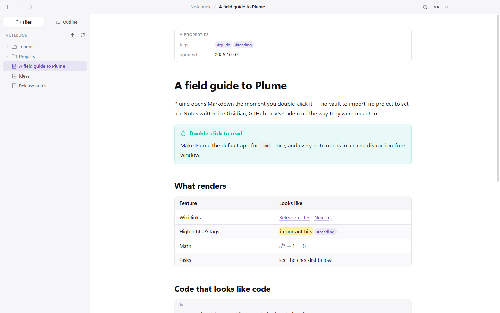
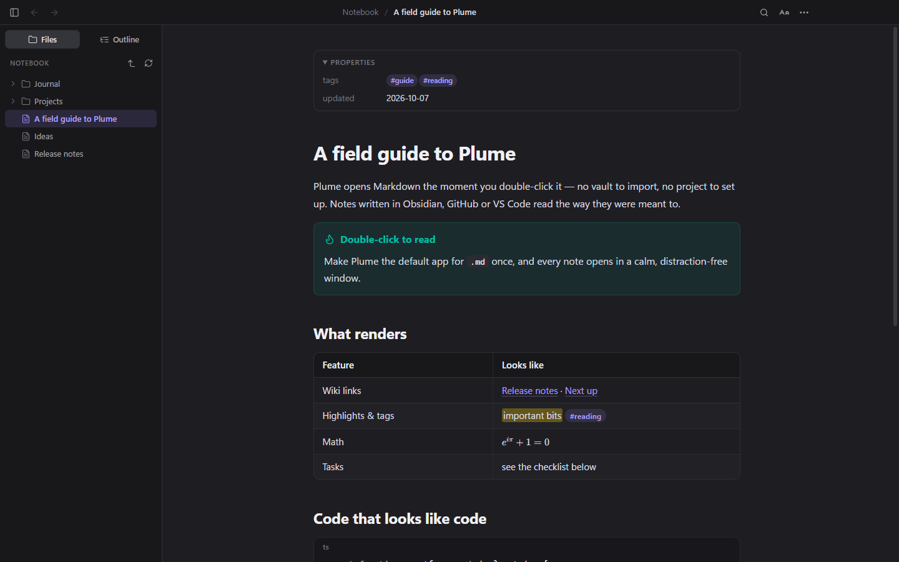
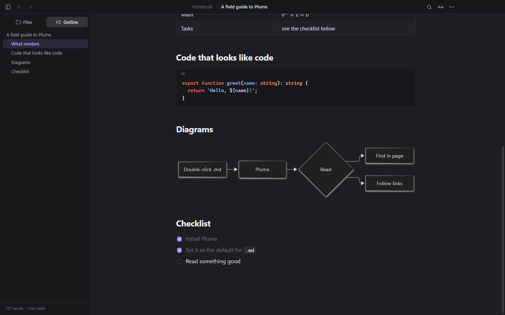
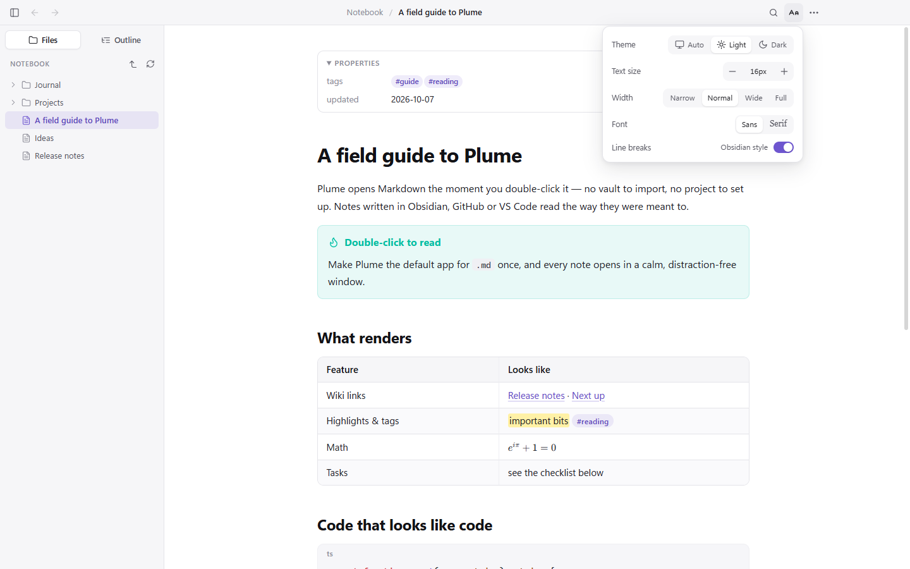
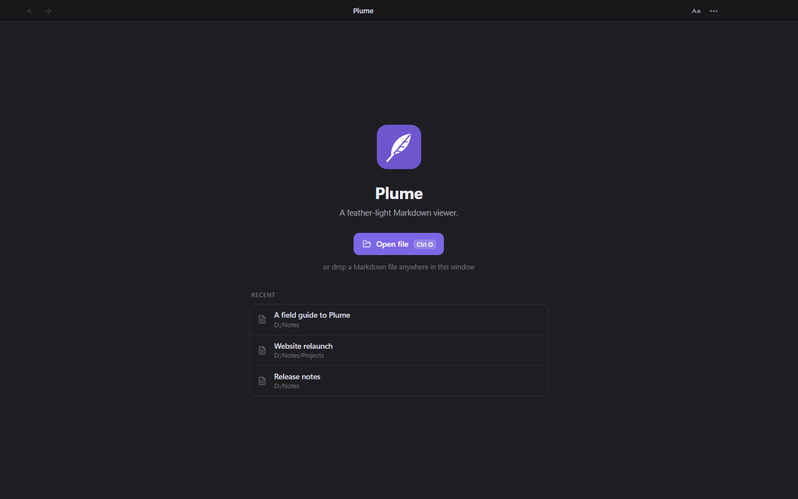

<p align="center">
  
</p>

<h1 align="center">Plume</h1>

<p align="center">
  <b>A feather-light Markdown viewer and editor for Windows, macOS and Linux.</b><br>
  Double-click any <code>.md</code> file and it opens instantly — no workspace to import, no project to set up. Just the document, beautifully set.
</p>

<p align="center">
  <a href="https://plume-md.com"><b>plume-md.com</b></a>
</p>

<p align="center">
  <a href="https://plume-md.com/download.html"><b>Download</b></a> ·
  <a href="https://plume-md.com/docs.html">Documentation</a> ·
  <a href="https://plume-md.com/app.html">Your vault</a> ·
  <a href="RELEASE-NOTES.md">Release notes</a> ·
  <a href="#features">Features</a> ·
  <a href="#vault">Vault &amp; sync</a> ·
  <a href="#keyboard">Keyboard</a> ·
  <a href="#build-from-source">Build</a>
</p>

<p align="center">
  <a href="https://github.com/Ishan-Nim/plume/releases/latest"></a>
  <a href="https://github.com/Ishan-Nim/plume/blob/master/LICENSE"></a>
  
</p>



## Screenshots

| Dark mode | Code, diagrams & outline |
|---|---|
|  |  |
| **Reading settings** | **Welcome screen** |
|  |  |

## Features

- **Opens with one double-click.** Plume registers itself for `.md`, `.markdown`, `.mdown`, `.mkd`, `.mkdn`, `.mdwn`, `.mdtxt`, `.mdtext`. A second file opens in a new window of the already-running app — no cold start.
- **Reads Obsidian notes properly.** `[[wiki links]]`, `[[Note#Heading|alias]]`, `![[image.png|300]]`, `![[Note#Section]]` transclusion, callouts (`> [!tip]`, foldable `> [!warning]-`), `==highlights==`, `#tags`, `%%comments%%`, `^block` ids, front-matter Properties, and Obsidian-style line breaks (toggleable).
- **Full GitHub-flavoured Markdown.** Tables, task lists, footnotes, definition lists, emoji shortcodes, syntax highlighting (incl. PowerShell, Dockerfile, nginx…), KaTeX math, Mermaid diagrams.
- **Sidebar** with the folder tree around the file (the whole vault when the file is inside one) and an outline of headings with reading time.
- **Live preview.** Click a paragraph and it becomes editable where it sits; move away and it is a paragraph again. The rest of the page stays rendered. Inside the block you are editing, the Markdown markers hide themselves: `**bold**` reads as bold until the caret is in the word, then the stars are back to be edited — the same for italics, strikethrough, inline code, links, images and headings. The file is the Markdown you typed either way. A list, table or code block opens whole; diagrams, maths and images stay rendered. Editing a block rewrites only that block's own lines. Turn it off in **Reading settings → Live preview**.
- **Or the whole file as text.** Press the pencil, or `Ctrl+E`, for the raw Markdown in a plain editor — no hidden formatting model. Both ways of typing share one buffer, so `Ctrl+E` loses nothing. Nothing is written until you save, an unsaved change is never dropped silently, and a file changed elsewhere cannot overwrite your work.
- **New notes from the sidebar.** The `+` in the **Files** header starts one in the folder the tree is showing; every folder has a `+` of its own for a note inside it, and `Ctrl+Shift+N` does the first of those from the keyboard. You name it in the tree where the note will be — `Enter` creates it, opens it and leaves you ready to type, `Esc` leaves nothing behind. The button beside it makes a folder. A name Windows cannot open is refused on every platform, and an existing note is never overwritten.
- **Rename, move and delete from the tree.** Right-click any row for a menu — rename (`F2`), move to trash, open in a new window, copy path — and drag a note onto a folder to move it. **Renaming rewrites every link that pointed at the note:** `[[Plan]]`, `![[Plan]]`, `[[Plan#Heading|alias]]` and `[the plan](Plan.md)`, across the whole folder, with a count of what changed. Deleting goes to the system trash and asks first.
- **Open a folder** of notes from the welcome screen or **⋯ → Open folder…**: the sidebar roots itself there and stays there, and Plume remembers it for next time.
- **Live reload** — save the file in any editor and Plume updates in place, keeping your scroll position.
- **Updates that ask first.** Plume tells you when a new version is out and installs it when you say so. Every download is checked against the release's published checksum.
- **Find in page**, back/forward between linked notes, image lightbox, copy buttons on code blocks.
- **Light / dark / auto theme**, text size, reading width, sans/serif.
- **Git sync.** Keep a folder of notes in a Git repository — pull, commit, push — from **⋯ → Git sync…**, for Plume Vault account holders. It drives the Git already on your machine, so Plume never asks for a token and never stores one, and conflicts, submodules, LFS and signing behave as they do in your terminal.
- **Five colour palettes** — Plume, Starless, Greenwood, Commit and Lapis. A palette recolours whichever of light or dark is in force rather than replacing that choice, so auto still follows the system inside every one of them. The same five are on the website and the web app.
- **Print** and **Export to PDF** (with a PDF outline from your headings).
- **Open in editor** (VS Code or Cursor if installed, otherwise the system text editor), **Open in Obsidian** for vault files, **Open with…** (Windows), **Show in folder**.
- Safe by default: documents are sanitised, scripts never run, links to programs are never executed.

## Vault &amp; sync

Plume reads the files already on your disk, and that needs no account. Create a free
one and you also get **Plume Vault**: 100 MB of storage for syncing documents between
your computers, and a browser to read them in. It is free — there is no paid tier.

- **Local first.** Your notes are files on your computer, and that is the copy that
  matters. An account changes nothing by itself: signing in creates no vault and syncs no
  folder. When you want a folder kept in step with another computer, open it, go to the
  **Plume Vault** bar at the foot of the sidebar and press **Sync “that folder”**. A single
  file opened on its own is never synced: a vault is a folder.
- **Both ways, by itself.** What you write here goes up; what was written on another
  computer or in the web vault comes down; a document deleted on one side goes on the
  other. Plume watches while it runs and checks again every few minutes.
- **A vault holds more than one notebook.** Each folder you sync takes a folder of its own
  inside the vault, named after itself, so changing which folder syncs adds a second
  notebook rather than merging two into one. Three projects in three folders are three
  notebooks, and the one you switch away from is still there.
- **On a computer that has none of them**, sign in and the panel lists your notebooks.
  **Open here** makes the folder, downloads what is in it, and syncs from then on.
- **Nothing is destroyed to settle a disagreement.** Edited here *and* somewhere else before
  they met? Both are kept — yours stays and the vault's is saved beside it as
  `note (vault copy …).md`. An edit always beats a delete, and a delete arriving from
  elsewhere moves the file into a hidden `.plume-trash` folder rather than erasing it.
- Only documents and images are ever uploaded; programs and archives are refused by an
  allow-list and stay on your computer. That is why a 1.5 GB notebook is usually a few
  megabytes of vault. Your folder is never moved or renamed, and folders are kept:
  `Projects/Plume.md` arrives as `Projects/Plume.md`.
- **Nothing is flattened.** Every upload carries the revision that machine last saw. If
  the vault copy moved on in the meantime the write is refused, and you choose which
  copy to keep — Plume can save the other one beside yours so neither is lost.
- **A graph** of how your documents link to each other, from wiki links and Markdown links.
- **Read them anywhere** at [plume-md.com/app.html](https://plume-md.com/app.html).

### Project memory for Claude Code and other MCP clients

Create an API token in the web vault and an AI assistant can keep project memory,
decisions and notes in it — somewhere that outlives the session and that you can read
in Plume afterwards.

```json
{
  "mcpServers": {
    "plume-vault": {
      "command": "node",
      "args": ["/path/to/plume/mcp/index.js"],
      "env": { "PLUME_TOKEN": "plm_your_token" }
    }
  }
}
```

See [`mcp/`](mcp) for the server and its tools.

The vault's own server is closed source; the app, the website and the MCP client in
this repository are not.

## Install

Download the package for your system from [Releases](https://github.com/Ishan-Nim/plume/releases/latest), or build it yourself (below). The packages are not code-signed yet.

**Windows 10 / 11 (64-bit):** run `Plume-Setup-<version>.exe`. Plume installs for all users in `C:\Program Files\Plume` — Windows asks for administrator approval once — and adds Start-menu and desktop shortcuts. If SmartScreen warns, choose **More info → Run anyway**. Uninstall from **Settings → Apps → Installed apps**.

**macOS (Apple silicon or Intel):** open `Plume-<version>-mac-<arch>.dmg` and drag Plume into Applications. Plume is not notarized, so macOS blocks the first launch: right-click Plume → **Open**, or allow it under **System Settings → Privacy & Security**, or run `xattr -cr /Applications/Plume.app`.

**Linux (x64):** `sudo apt install ./Plume-<version>-linux-amd64.deb`, or make `Plume-<version>-linux-x86_64.AppImage` executable and run it.

### Make Plume the default for .md (Windows)

Windows only lets *you* choose default apps, so this is one click on your side. Any of these works:

- Right-click any `.md` file → **Open with** → **Choose another app** → **Plume** → **Always**.
- **Settings → Apps → Default apps**, type `.md` in *Set a default for a file type*, and pick **Plume**.
- In Plume, open **⋯ → Make Plume the default for .md** — it jumps straight to Plume's page in Settings.

After that, a double-click opens Markdown files straight into Plume. Plume also appears in the right-click **Open with** menu for every Markdown extension.

On macOS, select a `.md` file in Finder → **Get Info** → **Open with: Plume** → **Change All…**. On Linux, choose Plume under **Open With** in your file manager and set it as the default.

## Keyboard

On macOS, use `⌘` in place of `Ctrl` and `⌥` in place of `Alt`.

| Action | Keys |
|---|---|
| Open file | `Ctrl+O` |
| New window | `Ctrl+N` |
| New note in the folder shown | `Ctrl+Shift+N` |
| Rename in the file tree | `F2` |
| Close window | `Ctrl+W` |
| Find / next / previous | `Ctrl+F`, `Enter` / `F3`, `Shift+Enter` / `Shift+F3` |
| Back / forward | `Alt+←` / `Alt+→`, mouse side buttons |
| Toggle sidebar | `Ctrl+\` |
| Text size | `Ctrl+=` / `Ctrl+-` / `Ctrl+0`, `Ctrl`+wheel |
| Reload | `F5` / `Ctrl+R` |
| Edit one block, where it is | click it |
| Edit the whole file as text | `Ctrl+E` |
| Save | `Ctrl+S` |
| Open in your editor | `Ctrl+Shift+E` |
| Print | `Ctrl+P` |
| Full screen | `F11` |
| Open link in new window | `Ctrl`+click or middle-click |

## Build from source

```bash
npm install
npm start        # run in development
npm test         # unit tests
npm run icons    # re-render icons from resources/*.svg
npm run dist        # build release/Plume-Setup-<version>.exe (per-machine installer)
npm run dist:mac    # build the macOS .dmg and .zip (on a Mac)
npm run dist:linux  # build the Linux AppImage and .deb
```

End-to-end check of the whole vault flow in the real app — sign up, sync, graph, sign out
(point it at a vault API of your own, never production):

```bash
PLUME_VAULT_API=http://127.0.0.1:8098/api npx electron test/e2e/vault-flow.js
```

Visual smoke test (renders a document in the real app and saves a screenshot):

```bash
PLUME_OUT=shot.png npx electron test/e2e/capture.js test/fixtures/vault/kitchen-sink.md
```

The screenshots above come from the sample notes in [`docs/demo-notebook`](docs/demo-notebook), rendered by that harness.

## Project layout

```
src/main/       main process — windows, file access, settings, vault client, IPC, preload
src/renderer/   UI — markdown pipeline, DOM enhancements, find, sidebar, vault panel, graph
mcp/            MCP server, so an AI assistant can use the vault as project memory
site/           plume-md.com — the landing, download, docs and web-vault pages
resources/      icons (SVG sources + generated ICO/PNG), NSIS installer additions
scripts/        build + icon generation
test/           unit tests, e2e capture + vault-flow harnesses, fixture vault
docs/           screenshots and the demo notebook they are taken from
```

## Credits

Written and maintained by **Ishan Nim** — [personal site and blog](https://ishan-nim-portfolio-74tdd.ondigitalocean.app). Full credits are in [docs/CREDITS.md](docs/CREDITS.md).


The four colour palettes beyond Plume's own are derived from Obsidian community
themes, each MIT licensed. The CSS in this repository is Plume's; the colour
schemes are theirs, and the names here are different so neither is mistaken for
the other.

| Palette | Derived from | Author |
|---|---|---|
| Starless | [Void](https://github.com/0crazy-0/obsidian-void) | 0crazy-0 |
| Greenwood | [Everforest Enchanted](https://github.com/fireisgood/obsidian-everforest-enchanted) | fireisgood |
| Commit | [GitHub Flavored Markdown](https://github.com/tofrankie/obsidian-theme-gfm) | tofrankie |
| Lapis | [Sodalite](https://github.com/tomzorz/Sodalite) | tomzorz |

Void and Sodalite are dark-only upstream; their light sides are built from the
same hues so that Light and Auto keep working when one of them is chosen.

## Security

Markdown files are untrusted input. Plume renders them in a sandboxed, context-isolated window with a strict Content-Security-Policy; HTML is sanitised with DOMPurify, scripts never run, external links open in your browser, and links to local files only open documents, images, media and plain folders — programs, apps, scripts and shortcuts are only ever revealed in the file manager. A document cannot make Plume load files from other computers on your network.
