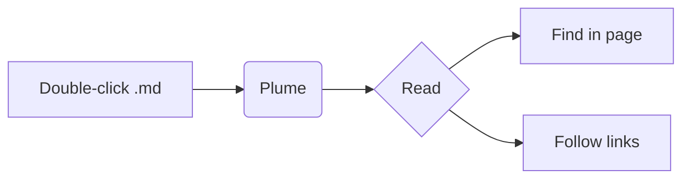

# A field guide to Plume

Plume opens Markdown the moment you double-click it — no vault to import, no project to set up. Notes written in Obsidian, GitHub or VS Code read the way they were meant to.

> [!tip] Double-click to read
> Make Plume the default app for `.md` once, and every note opens in a calm, distraction-free window.

## What renders

| Feature | Looks like |
|---|---|
| Wiki links | [[Release notes]] · [[Ideas#Next up\|Next up]] |
| Highlights & tags | ==important bits== #reading |
| Math | $e^{i\pi} + 1 = 0$ |
| Tasks | see the checklist below |

## Code that looks like code

```ts
export function greet(name: string): string {
  return `Hello, ${name}!`;
}
```

## Diagrams



## Checklist

- [x] Install Plume
- [x] Set it as the default for `.md`
- [ ] Read something good
