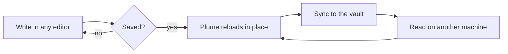
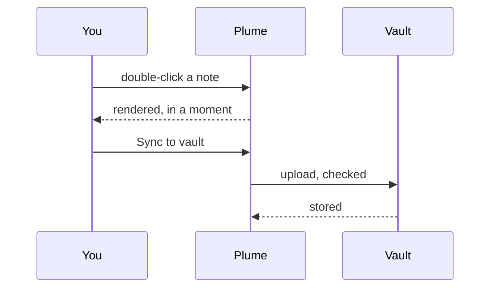

# A tour of Plume

Plume opens Markdown the moment you double-click it — no vault to import, no
project to set up. Notes written in **Obsidian**, *GitHub* or `VS Code` read the
way they were meant to.

> [!tip] Double-click to read
> Make Plume the default app for `.md` once, and every note opens in a calm,
> distraction-free window.

## What renders

| Feature | What you write | What you get |
|---|---|---|
| Wiki links | `[[Release notes]]` | [[Release notes]] · [[Ideas#Next up\|Next up]] |
| Highlights | `==important bits==` | ==important bits== |
| Tags | `#reading` | #reading #guide |
| Inline math | `$e^{i\pi}+1=0$` | $e^{i\pi} + 1 = 0$ |
| Footnotes | `[^1]` | like this[^1] |
| Tasks | `- [x] done` | see the checklist |
| Emoji | `:rocket:` | :rocket: :sparkles: |

[^1]: Footnotes collect themselves at the foot of the document, numbered and
linked both ways.

## Code that looks like code

```ts
export interface Note {
  title: string;
  tags: string[];
  updated: Date;
}

export function wordCount(markdown: string): number {
  // Strip fences and front matter before counting.
  const body = markdown.replace(/^---[\s\S]*?---/, '').replace(/```[\s\S]*?```/g, '');
  return body.split(/\s+/).filter(Boolean).length;
}
```

```python
from pathlib import Path

def notes(vault: Path) -> list[Path]:
    """Every Markdown file in the vault, newest first."""
    found = sorted(vault.rglob("*.md"), key=lambda p: p.stat().st_mtime, reverse=True)
    return [p for p in found if not p.name.startswith(".")]
```

```bash
# Sync a folder, then read it anywhere
plume sync ~/notes --vault
```

## Mathematics, set properly

The Gaussian integral, which turns up everywhere:

$$
\int_{-\infty}^{\infty} e^{-x^2}\,dx = \sqrt{\pi}
$$

And Bayes' theorem, inline and displayed:

$$
P(A \mid B) = \frac{P(B \mid A)\,P(A)}{P(B)}
$$

## Diagrams





## Things worth knowing

Term
: A definition list renders as one, rather than as a stray paragraph.

Live reload
: Save the file in any editor and Plume updates in place, keeping your scroll
  position.

> Nothing is written until you save, an unsaved change is never dropped
> silently, and a file changed elsewhere cannot overwrite your work.

> [!warning]- Not code-signed yet
> Windows SmartScreen and macOS Gatekeeper will warn you on first launch.
> Every release publishes checksums, and an update is verified against them
> before it runs.

## Checklist

- [x] Install Plume
- [x] Set it as the default for `.md`
- [x] Open a folder of notes
- [ ] Pick a palette you like
- [ ] Read something good

1. Open a file
2. Press `Ctrl+E` to edit it
   - the raw Markdown, in a plain editor
   - no hidden formatting model
3. Press `Ctrl+S` to save

---

*Plume is free software, released under the MIT licence.*
