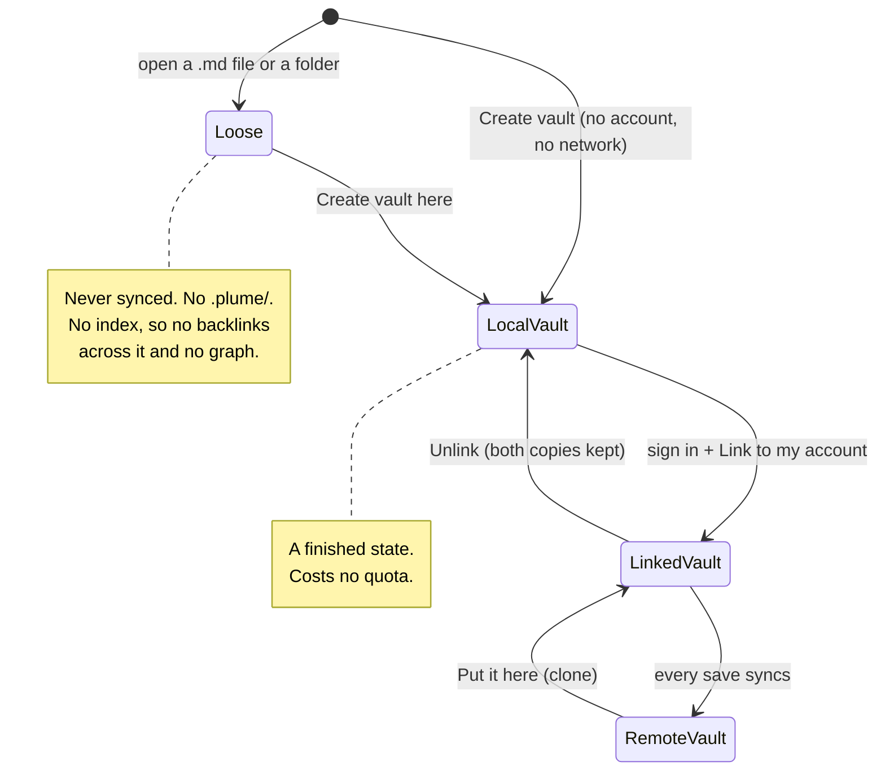
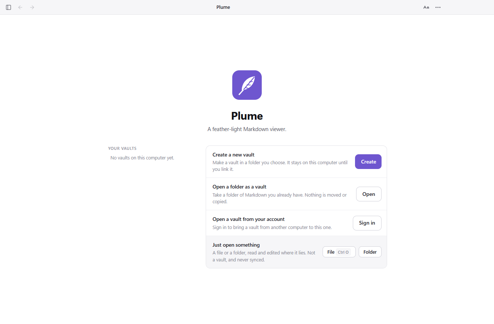

# Plume — vault architecture

Plume is a local-first Markdown editor. This document describes the **vault
model**: what a vault is, how one is made, how it relates to an account, how
storage is metered, and how a vault on disk stays in step with its copy in the
cloud.

The guiding principle is that **a folder on disk is never silently a vault**.
Opening a folder lets you read and edit the Markdown inside it and commits
Plume to nothing — no identity, no index, and nothing that could ever be
uploaded. It stays loose until somebody says otherwise. A vault is a deliberate
construct with its own identity, settings, and optionally a cloud counterpart.

This is the model as built, in Plume 1.8.0.

## Contents

1. [Core concepts](#core-concepts)
2. [The three states](#the-three-states)
3. [How you get into each one](#how-you-get-into-each-one)
4. [Switching between vaults](#switching-between-vaults)
5. [On-disk vault structure](#on-disk-vault-structure)
6. [Cloud and account data model](#cloud-and-account-data-model)
7. [Storage and quota](#storage-and-quota)
8. [Sync](#sync)
9. [What syncs and what stays local](#what-syncs-and-what-stays-local)
10. [Decisions, and why](#decisions-and-why)
11. [Where this lives in the code](#where-this-lives-in-the-code)

## Core concepts

| Term | Meaning |
|---|---|
| **Vault** | A folder Plume has explicitly initialised by writing a `.plume/` directory into it. It has a stable `vault_id`, its own settings, and an index of its files. |
| **Loose file / loose folder** | A `.md` file or a folder of `.md` files opened ad hoc. Editable, but it is **not** a vault and **never** syncs. |
| **Local-only vault** | A vault on disk with no account attached. Fully usable offline, forever; nothing leaves the device. |
| **Remote vault** | A vault in the account. May or may not be present on the computer you are sitting at. |
| **Linked vault** | A local vault connected to a remote one. This is the state in which sync happens. |
| **Clone** | Pulling a remote vault down to a computer, which produces a linked vault locally. |
| **Quota** | The total cloud storage an account may consume across all of its linked vaults. |

The distinction to hold onto: **locality and sync are orthogonal to whether
something is a vault.** A thing can be (a) not a vault at all, (b) a vault that
lives only on disk, or (c) a vault that also lives in the cloud and syncs. Loose
files are always (a) and can never move into (b) or (c) one file at a time —
promotion happens at the folder level.

## The three states



A vault moves forward through these states; it does not have to reach the end.
Somebody who never signs in stays at **local vault** forever, and that is a
first-class, fully supported way to use Plume.


## How you get into each one

Plume opens on the vault it was last in, on the note it was last showing. That
note is recorded per vault in `.plume/workspace.json`, which is device-local and
never synced, so two computers on one vault each come back to their own place in
it. If the record is gone, or names a note that is gone, the vault opens on
whatever reads as its front — `Welcome.md`, `README.md`, `index.md`, `home.md`,
or failing those the first note it finds.

The chooser is what a window opens on when there is nothing to come back to: no
vaults on this computer yet, or the last one moved or deleted. It is also what
**Manage vaults…** goes back to. The vaults this computer already has are on the
left, and the ways to get another on the right.



### 1. Loose files and folders

Open one or more `.md` files, or a folder, directly. Plume edits them in place.
There is no `.plume/`, no `vault_id`, and no account involvement.

- **It can never sync.** This is an explicit guarantee, not a default that can
  drift — see [Decisions](#decisions-and-why).
- Backlinks, the graph and vault-wide search are limited or unavailable,
  because there is no index to build them from.
- Closing the file leaves it untouched on disk.

### 2. Create a new vault

Name it, say which folder to put it in, and Plume makes a folder of that name
and initialises it by writing `.plume/`. The name is asked for first because the
name is also the folder's: a file dialog can only ask *where*, which is why this
is a screen of Plume's own rather than one. A new vault is given a `Welcome.md`
to open on — only ever written into a vault with no Markdown in it, and never
over a file that is already there. This works with **no account and no
network**.

- The vault is fully functional: notes, attachments, settings, search, graph.
- It consumes **zero** quota, because nothing is in the cloud.
- It can be linked later without losing any history.

### 3. Open a folder as a vault

The same act, pointed at a folder that already holds a pile of `.md` files.
Plume writes `.plume/` and **indexes the existing files where they lie** rather
than importing or copying them. Nothing is moved. The folder is now a local
vault and can be linked like any other.

Promotion is one-way and non-destructive: existing Markdown is adopted as-is,
and deleting `.plume/` returns the folder to loose with every note intact.

### 4. Link, or clone

Two paths lead to a linked vault:

- **Link an existing local vault.** Sign in, pick a vault, choose *Link to my
  account*. Plume creates the matching remote vault and performs an initial
  push.
- **Clone a remote vault.** Sign in, see the vaults in your account, choose
  *Put it here*. Plume makes the folder, writes a `.plume/` with the link
  already recorded, and downloads the contents. From then on it is an ordinary
  linked vault.

## Switching between vaults

Having more than one vault is the normal case — one per project, or one for
work and one for everything else — so moving between them is not a thing to go
back to the welcome screen for. The bar at the foot of the sidebar names the
vault you are in and is the control for leaving it: press it and the others are
there. The overflow menu and **Ctrl+Shift+V** open the same list.


It lists each vault by name and folder, marks the linked ones, and filters as
you type once there are more than a handful. Vaults are remembered as you make
or open them; removing one from the list does not touch the folder.

## On-disk vault structure

A vault is any folder containing a `.plume/` directory. Everything outside it is
user content; everything inside is Plume's bookkeeping.

```text
MyVault/
├── .plume/
│   ├── vault.json          # identity: vault_id, name, created_at, schema_version
│   ├── config.json         # editor and vault settings
│   ├── link.json           # the account link; ABSENT on a local-only vault
│   ├── .gitignore          # keeps per-device state out of a repo
│   ├── sync/
│   │   ├── manifest.json   # path -> { hash, size, mtime, rev } for every tracked file
│   │   ├── state.json      # this device's cursor and pause flag
│   │   ├── pending/        # uploads waiting on quota
│   │   └── trash/          # documents removed because the remote said so
│   ├── workspace.json      # the note this computer left the vault on (device-local)
│   └── cache/              # search index, thumbnails (device-local, rebuildable)
├── Notes/
│   └── idea.md
├── attachments/
│   └── diagram.png
└── Welcome.md
```

Key files:

- **`vault.json`** — the vault's permanent identity, generated once at
  creation. This is what makes the folder "a vault" rather than "a folder with
  Markdown in it". If it is ever damaged, it is regenerated rather than treated
  as absent: forgetting that a folder was a vault is how a second copy of a
  notebook gets made.
- **`link.json`** — present only once the vault is linked. Holds the account,
  the remote vault id and when it was linked. *Unlink* deletes it and the vault
  reverts to local-only without touching a single note.
- **`sync/manifest.json`** — the per-file index that drives diffing. Every
  tracked file has a content hash and a revision.
- **`sync/state.json`** — this device's position in the sync history, and
  whether sync is paused here. Device-local on purpose: two computers syncing
  the same remote vault have different cursors, and pausing is a decision about
  one machine.

A vault cannot contain another vault. Both directions are refused at creation —
a folder inside a vault, and a folder that already holds one — because nested
vaults make it ambiguous which vault owns a file, and therefore where that file
syncs.

## Cloud and account data model

```text
Account
├── quota_limit          # bytes, by plan — 100 MB on the free tier
├── quota_used           # sum of remote_size across all remote vaults
└── vaults[]
    └── RemoteVault
        ├── remote_name          # one top-level folder of the account's store
        ├── remote_size          # bytes stored in the cloud for this vault
        └── objects[]            # content-addressed blobs + path mapping
```

The account holds a flat, content-addressed store keyed by path. **A remote
vault is one top-level folder of that store**, and every document in it is named
under that folder: `Field Notes/Journal/today.md` is `Journal/today.md` inside
the vault `Field Notes`.

That is the entire server-side mapping, and it is what lets one account hold any
number of vaults without the server having to know what a vault is. Two vaults
can each hold a `Notes/today.md` and never meet; cloning one is "everything
under this prefix" rather than a list the client has to be trusted to assemble.

Names are made unique when a vault is linked, because two vaults linked under
one name would merge into one.

## Storage and quota

1. **Vault count is unlimited.** Nothing counts or caps vaults.
2. **Quota is a single shared pool** — total bytes synced to the cloud, summed
   across all of the account's remote vaults. Not a per-vault limit.
3. **Only synced content counts.** Local-only vaults and loose files consume
   **zero** quota. Quota is spent only when a vault is linked and pushed.
4. **Attachments count too.** Images and other binaries inside a linked vault
   count alongside the Markdown.
5. **Over quota is a soft stop on upload, never a block on local work.** When a
   push would exceed the limit the local edit still saves to disk; only the
   upload waits, recorded in `.plume/sync/pending/` so it is still waiting after
   a restart. Pulling and local editing are never blocked.

"Unlimited vaults" and "a storage cap" are not in tension: the cap is on cloud
bytes, not on how many vaults organise those bytes. A hundred small linked
vaults and one large one are treated identically by the meter.

## Sync

Sync is **per vault, manifest-based and incremental**. Any number of vaults can
be linked at once; each is its own job with its own manifest, cursor and
watcher. They share only the quota.

### The three opinions

Every document is judged on three things, not two: the copy here, the copy in
the remote vault, and the manifest entry — what this machine last saw of it.
Without the third, "these two differ" cannot be told apart from "one of them
changed", and one side always loses silently.

| Here | Remote | Base | What happens |
|---|---|---|---|
| changed | unchanged | matches remote | push |
| unchanged | changed | matches here | pull |
| new | absent | none | push |
| absent | new | none | pull |
| unchanged | deleted | matches here | delete here, into `.plume/sync/trash/` |
| deleted | unchanged | matches remote | delete there |
| changed | deleted | stale | **push** — an edit always beats a delete |
| changed | changed | matches neither | **conflict** — keep both |

### Save → sync

1. A note in a linked vault is saved.
2. The watcher waits for the writes to settle, then the vault is re-walked and
   changed files re-hashed.
3. The whole plan is worked out before any of it is applied, so an interrupted
   sync has not half-applied a plan made from a vault that has since moved on.
4. Pulls happen first, then conflict copies, then pushes, then deletes — so
   nothing on this disk is removed on the remote's word before everything that
   is staying has arrived.
5. The manifest is written as the sync goes, not at the end: a sync killed
   halfway has recorded what it actually did.

### Conflicts

When the same file changed on two computers against the same base, Plume keeps
**both**. The remote copy is written beside the local one as, for example,
`idea (conflict 2026-10-09 LAPTOP).md`, and the local one goes up. It is named
for the day and the machine because a conflict from a laptop last week and one
from this desktop this morning are different things, and whoever sorts them out
needs to be told which is which.

Nothing is silently overwritten or lost.

### The delete alarm

A sync that would remove at least ten documents **and** at least a third of what
is there stops and says so instead of doing it. Deleting is the only thing here
that syncing again cannot undo, and the ways it goes wrong are not small ones: a
vault relinked to the wrong remote, a drive that has not finished mounting, a
folder restored from a month-old backup. Every one of those looks from inside
the sync exactly like "they deleted everything", and the right answer to that is
to stop and let a person look at it.

### Offline

Saves write to disk as always. The vault syncs when the computer is next online
and signed in; nothing is queued up in a way that can be lost, because the disk
is the queue.

## What syncs and what stays local

| Item | Synced? | Why |
|---|---|---|
| `*.md` and text documents in a linked vault | **Yes** | The point of the vault. |
| Images in a linked vault | **Yes** | Part of the vault; counts against quota. |
| Everything else — programs, archives, installers | **No** | An allow-list, not an accident. A vault that happens to hold an `.exe` syncs its notes and leaves the rest alone. |
| `.plume/` in its entirety | **No** | Bookkeeping, not content. Skipped by the walk. |
| Loose files and loose folders | **Never** | Not part of any vault, by design. |
| Local-only vaults | **No** | Not linked to an account. |

## Decisions, and why

These are the choices that were open, and what was settled.

**A single loose `.md` file cannot become a vault.** There is no folder to
initialise that would not be a guess. *Create vault* on a lone file is not
offered; the folder it sits in can be made one.

**Nested vaults are refused in both directions.** Checked at creation: upward by
walking the ancestors, downward by a shallow scan. Ambiguous file ownership is
ambiguous sync.

**Unlink keeps both copies.** It removes `link.json`, clears the manifest and
stops sync. The folder keeps every note and the remote vault keeps every note —
so it goes on using quota until it is deleted. *Delete from your account* is a
separate, named, destructive act, and the only one that frees space. It leaves
copies on your computers exactly where they are.

**Deleting a local vault folder does not delete the remote one.** The remote
copy is still there, still counted, and still clonable. Removing a vault from
this computer's list is about the list and touches nothing.

**Conflict files are not auto-pruned.** They are ordinary Markdown with an
ordinary name; resolving one is editing and deleting it, like any other note.
Plume does not decide when somebody is finished with a conflict.

**Documents removed on the remote's word go to `.plume/sync/trash/`, not away.**
This is the one place something on this disk disappears because of something
that happened somewhere else, so it goes away recoverably. The folder is inside
`.plume/`, so the walk skips it and nothing in it is ever uploaded again.

**The renderer cannot upload.** There is no IPC channel that takes a local path
and a destination. Uploading is something a linked vault does to its own
contents, decided in the main process from that vault's manifest. The guarantee
that a loose file never reaches the cloud is not a rule the renderer is trusted
to keep — it is a channel that does not exist.

**End-to-end encryption is still open.** Nothing here is encrypted client-side
today. If it were, `quota_used` would have to be measured on ciphertext size,
and content-addressed dedup would only work within a single key scope.

## Coming from an older Plume

Before 1.8.0 an account synced exactly one folder, named by two settings: which
folder, and which top-level name it occupied in the store. That is a linked
vault in all but the `.plume/` directory, so on first launch it becomes one —
same folder, same remote name, same documents.

The manifest starts empty, so the first sync afterwards hashes both sides and
compares. Identical files are left alone, so a carried-across vault uploads
nothing and downloads nothing. Nobody loses a sync by updating.

## Where this lives in the code

| File | What it owns |
|---|---|
| `src/main/vaults.js` | The on-disk format. Find, create, link, unlink, the manifest, the pending queue, the registry of known vaults, the device id. |
| `src/main/sync.js` | Per-vault sync: the walk, the three-way decision, the plan, the watchers, the delete alarm. |
| `src/main/vault.js` | The account API: sign in, the document store, listing and deleting remote vaults. |
| `src/main/main.js` | The IPC surface (`vaults:*`, `sync:*`) and the migration from the old model. |
| `src/renderer/vault.js` | The sidebar panel — the three states and the actions on each. |
| `test/vaults.test.js` | The on-disk format and its guarantees, stated as tests. |
| `test/sync.test.js` | The three-way decision, exhaustively. |
| `test/e2e/vault-sync-flow.js` | The whole model against a real server: loose stays loose, two vaults at once, conflicts, cloning, unlink, delete. |
| `test/e2e/vault-flow.js` | The same ground through the real UI. |
