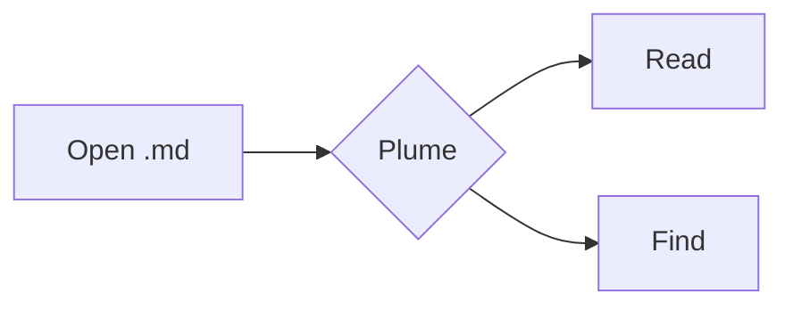

# Plume kitchen sink

A paragraph with **bold**, *italic*, ~~strike~~, ==highlight==, `inline code`, a [relative link](notes/Other%20Note.md), an [external link](https://example.com), a [[Other Note]] wiki link, an [[Other Note#Section two|aliased section link]], a [[Missing note]], and a #tag. Footnote reference[^1]. Emoji :rocket: :tada:.
Second line in the same paragraph (Obsidian line break). Issue #12 and C# stay plain.

## Callouts

> [!note] A note
> With **body** text and `code`.

> [!warning]- Collapsed warning
> Hidden until opened.

> [!tip]
> Tip without a title.

> [!danger] Danger zone
> Line one
> Line two

> A plain blockquote stays a blockquote.

## Code

```js
// comment
const greet = (name) => `Hello, ${name}!`;
console.log(greet('Plume'));
```

```powershell
Get-ChildItem -Path . -Filter *.md | Select-Object Name
```

    indented code block without a language

## Table

| Feature | Status | Notes |
|:--|:--:|--:|
| Tables | ✅ | aligned right |
| Tasks | ✅ | see below |
| Math | ✅ | KaTeX |

| | |
|---|---|
| Path | `/.well-known/aliengate-verify.txt` |
| Scheme | HTTP or HTTPS |

## Tasks

- [x] Done task
- [ ] Open task
  - [ ] Nested task

1. First
2. Second
   - nested bullet

## Math

Inline $E = mc^2$ and display:

$$
\int_0^\infty e^{-x^2}\,dx = \frac{\sqrt{\pi}}{2}
$$

Prices like $5 and $10 stay as text.

## Mermaid



## Images


Wiki image: ![[plume.png|64]]


## Embeds

![[Other Note#Section two]]

## HTML

<details><summary>Click to expand</summary>

Hidden **markdown** inside details.

</details>

<p align="center">Centered paragraph</p>

<script>document.title = 'XSS-SCRIPT'</script>

<a href="javascript:document.title='XSS-HREF'">bad link</a>
<style>body{background:red !important}</style>
<iframe src="https://example.com"></iframe>

日本語のテキストも正しく表示されます。見出しや表も問題ありません。

Term
: Definition list item

Visible %%hidden comment%% text.

A paragraph with a block id ^block-1

Jump to [the tables](#table) or [[#Math]].

[^1]: The footnote text.
